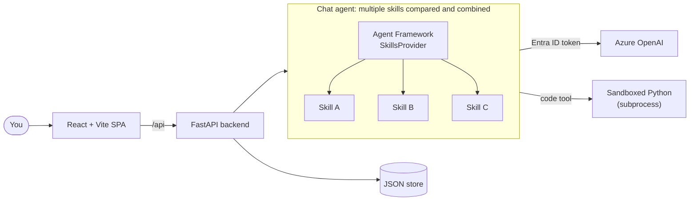

# Agent Skills Dev Studio

> Local, single-user web portal for authoring Microsoft Agent Skills and chatting with an Azure OpenAI agent over Microsoft Entra ID.


**Agent Skills Dev Studio** is a local, single-user web portal for authoring Microsoft Agent Skills and watching how they behave, both on their own and combined, against a live Azure OpenAI agent. Group skills into projects, edit them in Markdown with a live best-practices score, keep a full version history, optionally attach self-contained Python that runs as a tool during the chat, then select several at once and chat with the single agent they form.

Authentication runs entirely through Microsoft Entra ID (managed identity or `az login`). No API keys or connection strings are stored anywhere.

## Highlights

| Capability | What you get |
| --- | --- |
| Skill authoring | Markdown editor with live preview, organized into projects |
| Best-practices score | A 0 to 100 rating with a per-check breakdown that updates as you type |
| Version history | Every save is snapshotted; reload or delete any past version |
| Executable skills | Attach self-contained Python that runs as a sandboxed tool during the chat, localized to your browser |
| Multi-skill agent | Tick several skills and chat with the one agent they combine into |
| Combination analysis | Flags conflicts, contradictions, overlaps, and gaps between selected skills |
| Streaming chat | Token-by-token replies over server-sent events |
| Health check | One click probes the Azure OpenAI endpoint and deployment |

## Architecture



> [!NOTE]
> The chat is where skills come together. Tick several skills and the agent advertises each one, loads them on demand, then compares and combines them in a single conversation: overlaps merge, conflicts surface, and gaps show up.

In production the FastAPI backend serves the compiled SPA and the API together on one origin (port 8000). In development, Vite serves the UI on port 5173 and proxies `/api` to the backend.

## Skills on the fly

Skills are assembled per request, not baked into the agent. Each time you chat, the backend turns the skills you ticked into Microsoft Agent Framework `InlineSkill` objects on the fly (name, description, and Markdown body), hands them to a `SkillsProvider`, and spins up a fresh agent. That makes it cheap to mix and match: change the selection, send a message, and compare how the new combination behaves, all without redeploying or rewriting a single mega-prompt.

## Executable skills

A skill can do more than instruct the model: it can carry self-contained Python that runs as part of the invocation. Add code in the editor's **Python code** pane, and when the skill is active the agent gets a matching `run_<skill>` tool. The model calls it when the skill's instructions ask, the code runs, and its output flows back into the reply.

The code runs in an isolated subprocess with a timeout, a scrubbed environment, and resource limits. This is deliberate, sandboxed execution for a local, single-user studio, not a boundary for untrusted input, so only run code you trust.

Your browser's timezone and locale travel with each chat message, so a skill can localize what it returns. The code receives a JSON object on stdin with `time_zone`, `locale`, and `user_input`, and prints its result to stdout.

The bundled **localized-time** skill shows the pattern end to end. Its Python reads the browser context and prints the current time formatted for your locale:

```python
import json, sys
from datetime import datetime, timezone
from zoneinfo import ZoneInfo
from babel.dates import format_datetime

data = json.load(sys.stdin)
tz = data.get("time_zone") or "UTC"
locale = (data.get("locale") or "en-US").replace("-", "_")
now = datetime.now(timezone.utc)
print(format_datetime(now, format="full", tzinfo=ZoneInfo(tz), locale=locale))
```

Ask "what time is it?" with that skill active and the agent calls the tool, then answers with a timestamp localized to your browser, for example `Thursday, July 2, 2026, 11:58:01 AM Eastern Daylight Time`.

## Getting started

There are two ways to run the portal. The dev container path needs the least setup because it ships Python, Node, uv, and the Azure CLI inside the container.

### Option A: Dev container and F5 (recommended)

1. Open the folder in VS Code and choose **Reopen in Container** when prompted. This needs Docker and the Dev Containers extension. On first build the container installs Python, Node, uv, the Azure CLI, and every dependency.
2. Copy the environment template and fill in your Azure OpenAI endpoint and deployment.

   ```bash
   cp .env.example .env
   ```

3. Sign in so `DefaultAzureCredential` has an identity to use.

   ```bash
   az login --use-device-code
   ```

4. Press **F5** and pick **Full Stack: Backend + Frontend**. The backend and the Vite dev server start together.

| Port | What runs there |
| --- | --- |
| 8000 | Portal API and UI |
| 5173 | Vite dev server with hot reload |

> [!TIP]
> The compound launch lives in `.vscode/launch.json`. You can also start the backend or the frontend on its own from the Run and Debug dropdown.

### Option B: Local with uv

Requires Python 3.10+, uv, and Node 18+.

```bash
cp .env.example .env
uv sync
uv run uvicorn backend.main:app --reload
```

Run the frontend with Vite for hot reload during development.

```bash
cd frontend
npm install
npm run dev
```

### Windows shortcut

`start.ps1` wraps both steps. Production mode builds the SPA and serves everything from port 8000; dev mode runs the backend and Vite with hot reload.

```powershell
./start.ps1        # build and serve on http://127.0.0.1:8000
./start.ps1 -Dev   # backend plus Vite hot reload
```

## Configuration

Set these in `.env`, copied from `.env.example`.

| Variable | Required | Purpose |
| --- | --- | --- |
| `AZURE_OPENAI_ENDPOINT` | Yes | Azure OpenAI resource URL |
| `AZURE_OPENAI_CHAT_MODEL` | Yes | Chat deployment name |
| `AZURE_OPENAI_API_VERSION` | No | REST API version (defaults to `2024-10-21`) |

> [!IMPORTANT]
> Keep real values only in `.env`, which is gitignored. The committed `.env.example` holds placeholders. Never put secrets in `.env.example`.

## Authentication

The agent authenticates with Microsoft Entra ID. The backend selects a credential by priority:

1. Service principal (`ClientSecretCredential`) when a client secret, client id, and tenant id are all set.
2. User-assigned managed identity when a managed-identity client id is set.
3. `DefaultAzureCredential` otherwise, which picks up your local `az login`.

Grant whichever identity you use the **Cognitive Services OpenAI User** role on the Azure OpenAI resource. Inside the dev container, `az login` is the usual path; the optional service-principal block in `.env` is read by `.devcontainer/az-login.sh` on container start.

> [!NOTE]
> If a call fails, use the status pill in the top bar to probe the endpoint and deployment.

## Project structure

```text
backend/            FastAPI app
  routes_crud.py    Projects, skills, and version endpoints
  routes_chat.py    Streaming chat, agent evaluation, health
  chat.py           Agent, Azure OpenAI client (Entra ID), skill code tools
  skill_exec.py     Sandboxed subprocess runner for skill Python
  validate.py       Best-practices scoring
  store.py          Atomic JSON persistence
  data/             Runtime store (gitignored)
frontend/
  src/components/   Tree, Editor, Chat
  src/api.js        Fetch wrappers for the API
.devcontainer/      Container definition and Azure CLI sign-in helpers
start.ps1           Windows launcher
```

## How it works

Skills load through the Agent Framework SkillsProvider instead of being concatenated into one large prompt. Each skill is advertised by name and description, and the agent pulls a full skill body on demand through the `load_skill` tool. When a skill includes Python, the agent also gets a matching `run_<skill>` tool that executes the code in an isolated subprocess and feeds the result back into the reply. Where skills overlap, the agent combines them; where they conflict, it applies the most restrictive rule and points out the conflict. The combination analysis runs the same selection through a scorer that reports conflicts, contradictions, overlaps, and gaps before you start chatting.

## License

Released under the [MIT License](LICENSE).
